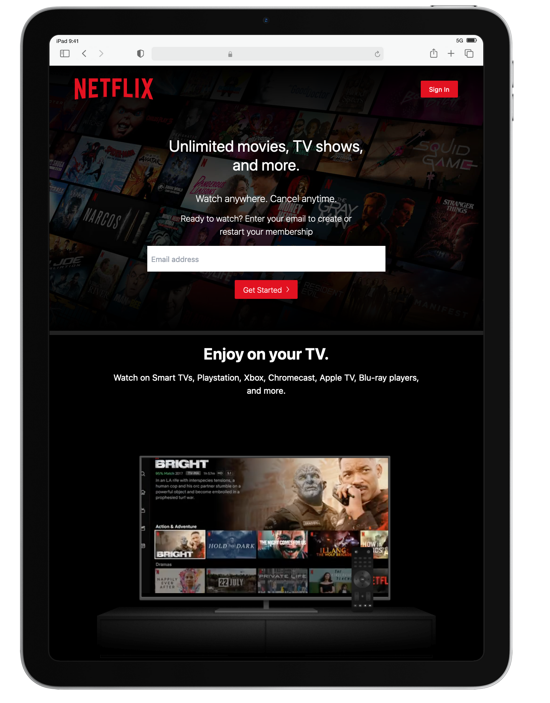

## DEMOS Netflix with tailwindcss
<a href="https://tailwincss-netflix.vercel.app/" target="_blank">Voir en direct</a>

 
  
  
  

# Intallation in local:

### `git clone https://github.com/Ange0/tailwincss-netflix.git`
